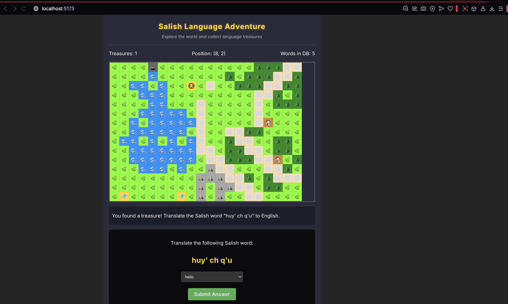

# SLP Lang Learn: Salish Language Learning Game

A gamified language learning application that helps users learn Salish language words and phrases through an interactive exploration adventure.

## 📋 Table of Contents

- [Overview](#overview)
- [Features](#features)
- [Getting Started](#getting-started)
  - [Prerequisites](#prerequisites)
  - [Installation](#installation)
  - [Running the Application](#running-the-application)
- [How to Play](#how-to-play)
- [Tech Stack](#tech-stack)
- [Contributing](#contributing)
- [License](#license)

## 🌟 Overview



SLP Lang Learn combines language learning with gameplay, creating an engaging experience where users explore a procedurally generated world while collecting "language treasures." When a treasure is found, players must correctly translate Salish words to English to collect the treasure and advance their learning.

## ✨ Features

- **Interactive Game Map**: Navigate through a procedurally generated landscape with different terrain types
- **Character Movement**: Control your character using arrow keys or WASD
- **Language Challenges**: Translate Salish words to English to collect treasures
- **Backend Integration**: Connects to a Salish language database for vocabulary words
- **Responsive Design**: Works on various screen sizes

## 🚀 Getting Started

### Prerequisites

- Node.js (v14 or higher)
- Python (v3.6 or higher)
- pip (Python package manager)

### Installation

1. **Clone the repository**

```bash
git clone https://github.com/yourusername/slp-lang-learn.git
cd slp-lang-learn
```

2. **Install frontend dependencies**

```bash
cd my-learning-app
npm install
```

3. **Install backend dependencies**

```bash
cd ../my-learning-api
pip install -r requirements.txt
```

### Running the Application

1. **Start the backend server**

```bash
cd my-learning-api
python app.py
```

The API server will start on http://localhost:5001

2. **Start the frontend development server**

```bash
cd my-learning-app
npm run dev
```

The application will be available at http://localhost:5173

## 🎮 How to Play

1. **Navigation**: Use arrow keys (↑ ↓ ← →) or WASD keys to move your character "X" around the map.

2. **Exploration**: Navigate through different terrain types:
   - 🌿 Grass (passable)
   - 🌊 Water (impassable)
   - 🌲 Trees (impassable)
   - ⛰️ Mountains (impassable)
   - ⬜ Paths (passable)
   - 🏠 Houses (impassable)
   - 🕳️ Caves (passable)

3. **Collecting Treasures**: Find 💎 treasures on the map and approach them.

4. **Language Challenges**: When you find a treasure, you'll be presented with a Salish word to translate:
   - Select the correct English translation from the dropdown menu
   - Click "Submit Answer" to check your response
   - Correct answers add the treasure to your collection
   - Incorrect answers provide feedback and the correct translation

5. **Generate New Maps**: Click the "Generate New Map" button to create a new procedurally generated world to explore.

## 💻 Tech Stack

- **Frontend**: React, TypeScript, Vite
- **Backend**: Python, Flask
- **Styling**: CSS
- **Data Management**: JSON

## 🤝 Contributing

Contributions are welcome! Please feel free to submit a Pull Request.

1. Fork the repository
2. Create your feature branch (`git checkout -b feature/amazing-feature`)
3. Commit your changes (`git commit -m 'Add some amazing feature'`)
4. Push to the branch (`git push origin feature/amazing-feature`)
5. Open a Pull Request

## 📄 License

This project is licensed under the MIT License - see the LICENSE file for details.

---

Developed with ❤️ for the GenAI Bootcamp 2025
